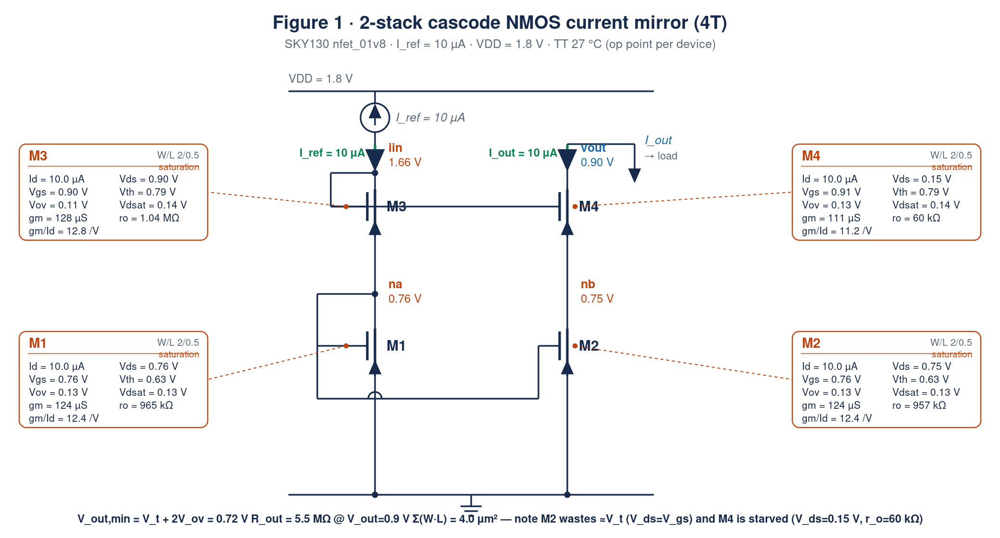
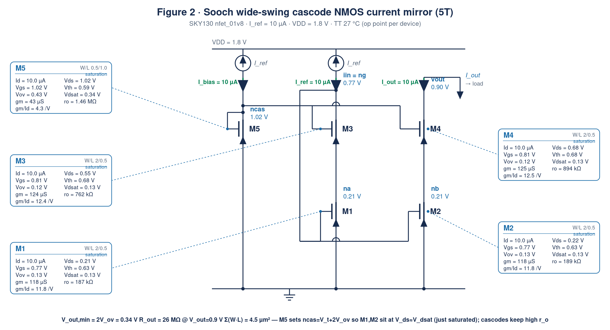
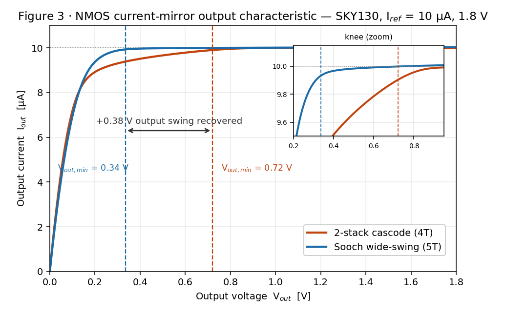
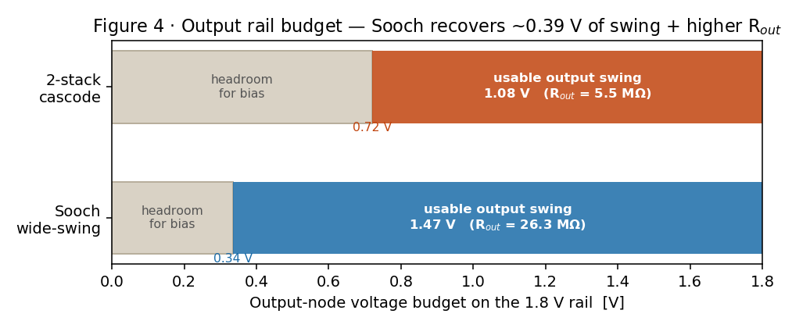

# NMOS Bias Current Mirror — Sooch wide-swing vs. 2-stack cascode (SKY130)

Two NMOS **cascode current mirrors** that generate the same 10 µA bias current,
designed and simulated in the open-source **SkyWater SKY130** 130 nm process at
**1.8 V**, and compared head-to-head:

- a **2-stack (standard) cascode** — 4 transistors, and
- a **Sooch wide-swing cascode** — 5 transistors,

showing why the extra bias device in the Sooch mirror buys **~0.4 V of output
headroom** *and* a **~5× higher output resistance** on a tight 1.8 V rail.

Everything is reproducible with open tools — `ngspice` and the open
[SKY130 PDK](https://github.com/google/skywater-pdk) (`sky130_fd_pr` device
models) — and contains no proprietary data.

---

## The two topologies

Both branches are two NMOS transistors tall (a **cascode**): a bottom mirror
device (`M1`/`M2`) and a cascode device (`M3`/`M4`) that shields the mirror from
output-voltage swing, giving the ~`gm·ro²` output resistance a cascode is prized
for. The **only** difference is *how the cascode gate is biased* — and that one
choice sets how much of the supply rail is left for the output.

### 2-stack cascode (4T) — the cascode gate self-biases to 2·V_gs



*Figure 1 — 2-stack cascode: per-device op-point cards, node voltages, and branch currents.*

The input branch is **diode-connected twice**, so the cascode gate rail sits at
`2·V_gs ≈ 1.66 V`. That forces the output mirror device `M2` to `V_ds = V_gs`
(≈ `V_t` of headroom **wasted**), and pushes the minimum output voltage up to
`V_out,min = V_t + 2·V_ov ≈ 0.72 V`.

### Sooch wide-swing cascode (5T) — a 1/4-size bias device drops the gate to V_t + 2·V_ov



*Figure 2 — Sooch wide-swing cascode: the 5th device M5 (¼-aspect) sets the low cascode-gate bias.*

An extra diode-connected device `M5` (sized ~¼ the aspect ratio) generates a
lower cascode-gate bias `ncas = V_t + 2·V_ov ≈ 1.02 V`. Now the bottom devices
`M1`/`M2` sit at `V_ds ≈ V_dsat ≈ 0.21 V` — **just** saturated, nothing wasted —
and the output swings down to `V_out,min = 2·V_ov ≈ 0.34 V`.

*Every transistor is annotated with its **W/L and full DC operating point** — Id,
Vgs, Vds, Vth, Vov, Vdsat, gm, ro, gm/Id and region — read straight from the
ngspice `.op` (Iref = 10 µA, VDD = 1.8 V, Vout = 0.9 V, TT, 27 °C). Those same
numbers are tabulated below and regenerated by `extract_op.py`.*

### Per-device operating point

**2-stack cascode**

| Device | Id (µA) | Vgs (V) | Vds (V) | Vth (V) | Vov (V) | Vdsat (V) | gm (µS) | ro | gm/Id (1/V) |
|--------|--------:|--------:|--------:|--------:|--------:|----------:|--------:|---:|------------:|
| M1 (bottom in)  | 10.0 | 0.76 | 0.76 | 0.63 | 0.13 | 0.13 | 124 | 965 kΩ | 12.4 |
| M2 (bottom out) | 10.0 | 0.76 | 0.75 | 0.63 | 0.13 | 0.13 | 124 | 957 kΩ | 12.4 |
| M3 (cascode in) | 10.0 | 0.90 | 0.90 | 0.79 | 0.11 | 0.14 | 128 | 1.04 MΩ | 12.8 |
| M4 (cascode out)| 10.0 | 0.91 | **0.15** | 0.79 | 0.13 | 0.14 | 111 | **60 kΩ** | 11.2 |

M2 is forced to `Vds = Vgs = 0.75 V` (≈V_t wasted) and M4 is left only `Vds =
0.15 V` — barely saturated, `ro` collapses to 60 kΩ, which caps the cascode's R_out.

**Sooch wide-swing cascode**

| Device | Id (µA) | Vgs (V) | Vds (V) | Vth (V) | Vov (V) | Vdsat (V) | gm (µS) | ro | gm/Id (1/V) |
|--------|--------:|--------:|--------:|--------:|--------:|----------:|--------:|---:|------------:|
| M5 (¼-size bias) | 10.0 | 1.02 | 1.02 | 0.59 | 0.43 | 0.34 | 43 | 1.46 MΩ | **4.3** |
| M1 (bottom in)   | 10.0 | 0.77 | **0.21** | 0.63 | 0.13 | 0.13 | 118 | 187 kΩ | 11.8 |
| M2 (bottom out)  | 10.0 | 0.77 | **0.22** | 0.63 | 0.13 | 0.13 | 118 | 189 kΩ | 11.8 |
| M3 (cascode in)  | 10.0 | 0.81 | 0.55 | 0.68 | 0.12 | 0.13 | 124 | 762 kΩ | 12.4 |
| M4 (cascode out) | 10.0 | 0.81 | **0.68** | 0.68 | 0.12 | 0.13 | 125 | **894 kΩ** | 12.5 |

M1/M2 sit at `Vds ≈ Vdsat` (just saturated — the wide-swing goal), so the output
cascode M4 keeps a healthy `Vds = 0.68 V` and `ro = 894 kΩ` → the ~5× R_out. Note
M5 runs at `gm/Id ≈ 4.3` (strong inversion, Vov ≈ 0.43 V) precisely because it is
sized ¼ down to generate the higher `ncas` bias.

---

## Specifications & simulation results

Operating point: **VDD = 1.8 V, Iref = 10 µA, TT, 27 °C.** Unit device
`nfet_01v8` **W/L = 2 / 0.5 µm** (V_ov ≈ 0.13 V, V_gs ≈ 0.76 V, r_o ≈ 0.97 MΩ).
Output resistance and current measured at **V_out = 0.9 V** (mid-rail).

| Parameter | Design target | **2-stack cascode** | **Sooch wide-swing** |
|-----------|---------------|--------------------|----------------------|
| Transistors | — | 4 | 5 |
| Reference-current legs | — | 1 (10 µA) | 2 (20 µA) |
| Active device area Σ(W·L) | — | 4.0 µm² | 4.5 µm² |
| Output current I_out | 10 µA ±2 % | 9.99 µA ✅ | 10.01 µA ✅ |
| **Output compliance V_out,min** | < 0.40 V | **0.72 V** ❌ | **0.34 V** ✅ |
| **Usable output swing** (of 1.8 V) | — | 1.08 V | **1.46 V** |
| **Output resistance** @ 0.9 V | > 10 MΩ | **5.5 MΩ** ❌ | **26.3 MΩ** ✅ |
| Line regulation ΔI_out/I_out | < 0.5 %/V | 1.81 %/V ❌ | **0.38 %/V** ✅ |
| Input-branch bias voltage | — | 1.66 V (2·V_gs) | 0.77 V (V_gs) |
| Bottom-device V_ds | ≈ V_dsat | 0.75 V (= V_gs, wasted) | **0.21 V** (≈ V_dsat) |

The Sooch mirror meets a low-headroom / high-R_out bias spec that the plain
cascode **fails on three axes** — for the price of one extra transistor (+0.5 µm²)
and a second reference-current leg.

### Output characteristic



*Figure 3 — output characteristic I_out vs V_out (knee zoom inset).*

Sweeping the output-node voltage (`ngspice -b tb_compliance.spice`): both mirrors
hold 10 µA in deep saturation, but the Sooch curve stays flat down to
**0.34 V** while the cascode has already collapsed by **0.72 V** — a **0.38 V**
recovery of output range. The zoomed knee shows the Sooch curve is also
*flatter* in the usable region (higher R_out).



*Figure 4 — output-node voltage budget on the 1.8 V rail (bias headroom vs usable swing).*

---

## Design notes

- **Why the Sooch mirror wins on R_out *too*, not just swing.** A cascode's
  output resistance is `≈ gm4·ro4·ro2`, which needs **both** stacked devices well
  into saturation. In the 2-stack cascode at `V_out = 0.9 V`, so much rail is
  eaten internally (`nb = 0.75 V`) that the output cascode `M4` is left with only
  `V_ds = 0.15 V` — barely saturated, `r_o ≈ 60 kΩ` — so R_out is only 5.5 MΩ.
  The Sooch mirror keeps `nb ≈ 0.21 V`, giving `M4` a healthy `V_ds ≈ 0.69 V`
  (`r_o ≈ 0.9 MΩ`) → **26 MΩ**. So at any usable mid-rail output the wide-swing
  mirror is better on *both* headroom and impedance; the plain cascode only
  catches up if you can afford to run its output near the top rail — which is
  exactly the headroom you don't have at 1.8 V.

- **The textbook "1/4 aspect" rule needs retuning in a real PDK.** The classic
  wide-swing bias device is sized `(W/L)/4` so that, *by square law with matched
  V_t*, its `V_gs = V_t + 2·V_ov` places the bottom devices exactly at `V_dsat`.
  In SKY130 that rule (`M5 = 0.5/0.5`, or `2/2`) lands `M1`/`M2` in **triode**
  (`V_ds ≈ 0.07 V < V_dsat ≈ 0.16 V`), which **collapses R_out** because a
  triode bottom device has `r_o` of only ~10 kΩ. Two effects break the ideal
  rule: at 10 µA the devices run in **moderate inversion** (V_ov ≈ 0.13 V, not
  square-law), and `M5`'s longer channel shifts its `V_t`. Re-tuning `M5` to
  **W/L = 0.5 / 1.0 µm** raises `ncas` to 1.02 V and seats `M1`/`M2` at
  `V_ds ≈ 0.21 V` — just inside saturation — recovering the full 26 MΩ. This is
  the design margin baked into `cm_sooch.spice`.

  **Why M5's channel length (1.0 µm) differs from cascode M3 (0.5 µm).** M5 is a
  *bias-only* device: it must develop the higher `V_gs = V_t + 2·V_ov` that sets
  `ncas`, which needs a **small aspect ratio** `W/L` (≈ ⅛ of the unit device) so
  the same 10 µA produces a large overdrive — `V_ov ≈ 0.43 V`, `g_m/I_D ≈ 4.3`
  (strong inversion), visible on its op-card. W is already at the ~0.42 µm
  minimum, so the aspect ratio is cut by **lengthening L to 1.0 µm** rather than
  narrowing W further; the longer channel also gives `M5` a higher `r_o`
  (1.46 MΩ) so `ncas` is better defined. `M3` is instead a signal-path cascode
  carrying the mirror current and keeps the unit `L = 0.5 µm` for good `r_o` at
  minimum area.

- **Input-side headroom is the cascode's other hidden cost.** The 2-stack
  cascode needs `2·V_gs = 1.66 V` just to bias its reference branch — only
  0.14 V from the 1.8 V rail. The Sooch reference branch needs only `V_gs =
  0.77 V` at its input node (plus the 1.02 V `ncas` node), so it is far more
  comfortable as the supply drops.

- **What the fifth transistor costs.** The Sooch mirror adds one device
  (+0.5 µm²) **and** a second 10 µA reference leg (the bias branch), so its
  reference-side current is 2× the cascode's. In a real bias network the `M5`
  leg can be run at a smaller current to claw most of that back; here both legs
  use `Iref` for clean matching.

- **The comparison ports across nodes and flavors** — only device sizing changes.
  A PMOS version mirrors the same argument on the top rail; a 3.3 V / 180 nm node
  follows the same headroom accounting with larger absolute voltages.

---

## Reproduce

Requires `ngspice` and the open SKY130 PDK (`volare enable --pdk sky130 <version>`).

```sh
cd spice
# point the .lib path at your PDK install:
sed -i "s#PDK_ROOT#$PDK_ROOT#g" *.spice
ngspice -b tb_op.spice           # DC op point + per-device table, both mirrors
ngspice -b tb_compliance.spice   # output sweep -> R_out, V_out,min, doc/_iv_*.txt
cd .. && python3 plot.py         # regenerate the figures from the sweeps
cd schematic
PDK_ROOT=$PDK_ROOT python3 extract_op.py    # dump per-device .op -> op_points.json
python3 draw_schematic.py                   # regenerate annotated schematics
```

## Files

```
README.md                      this document
schematic/cm_cascode.svg/.png  annotated 2-stack cascode (per-device op-point cards)
schematic/cm_sooch.svg/.png    annotated Sooch wide-swing cascode
schematic/draw_schematic.py    schematic generator (reads op_points.json)
schematic/extract_op.py        dump per-device .op to op_points.json
schematic/op_points.json       per-device operating point (both mirrors)
spice/cm_cascode.spice         2-stack cascode subcircuit (4T)
spice/cm_sooch.spice           Sooch wide-swing cascode subcircuit (5T)
spice/models.spice             PDK model include (edit PDK path)
spice/tb_op.spice              op point + per-device table
spice/tb_compliance.spice      output characteristic, R_out, compliance sweep
plot.py                        figures from the sweep data
doc/iv_compliance.png          output characteristic overlay (+ knee zoom)
doc/headroom_bars.png          rail-budget / R_out comparison
```

## References

[1] P. R. Gray, P. J. Hurst, S. H. Lewis, and R. G. Meyer, *Analysis and Design
of Analog Integrated Circuits*, 5th ed. Hoboken, NJ: Wiley, 2009, §4.2.5
("high-swing" / **Sooch cascode** current mirror). ISBN 978-0-470-24599-6.

[2] D. A. Johns and K. Martin, *Analog Integrated Circuit Design*. New York:
Wiley, 1997, §6.1 (wide-swing cascode current mirror). ISBN 978-0-471-14448-9.

[3] B. Razavi, *Design of Analog CMOS Integrated Circuits*, 2nd ed. New York:
McGraw-Hill, 2017, ch. 5 (cascode current mirrors, output resistance).
ISBN 978-0-07-252493-2.

[4] N. S. Sooch, "MOS cascode current mirror," U.S. Patent 4 550 284, Oct. 1985
(the wide-swing cascode bias that this mirror is named for).

## License

MIT (see `LICENSE`). Uses the open-source SkyWater SKY130 PDK (Apache-2.0).
